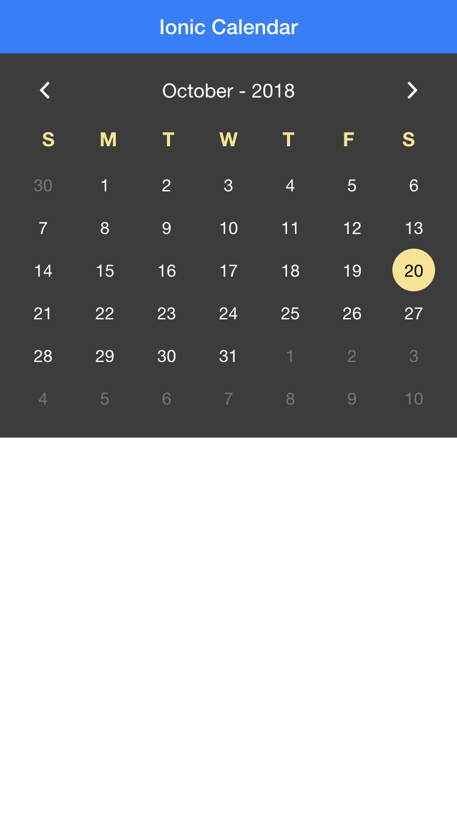
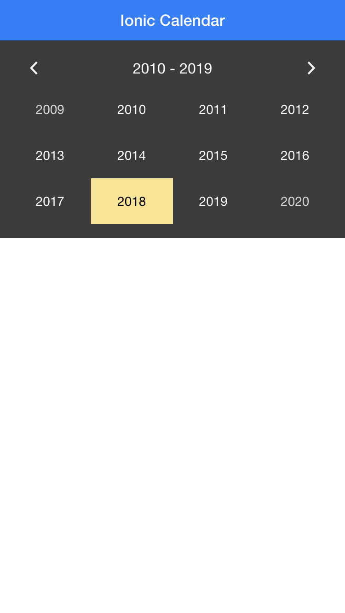

# ionic1-full-calendar

Simple Calendar for [Ionic](http://ionicframework.com/)

## Features

* simple
* easy to customize
* with on date select callback

>
``` JavaScript
angular.module('starter', ['ionic', 'ionic-full-calendar'])
```

## Screenshots
  

